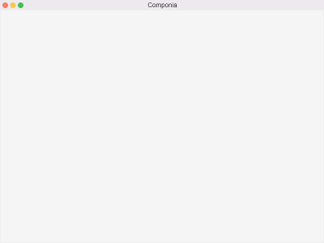
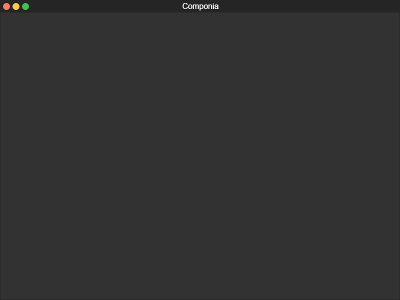
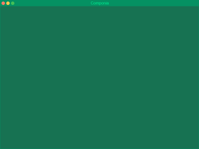
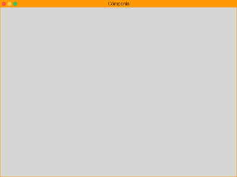
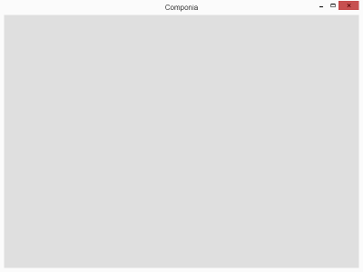
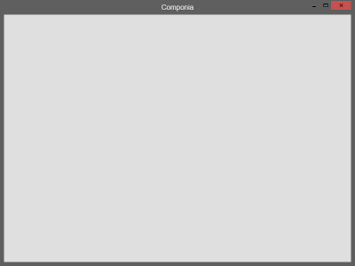
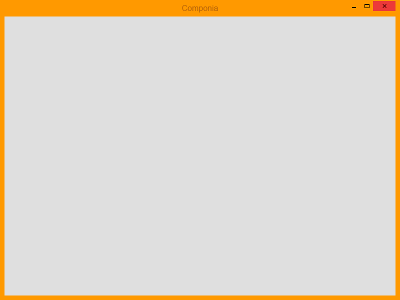
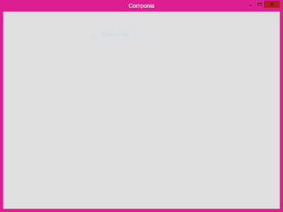

# componia
Window UI kit built with web technologies.

These components works well with electron and can work for any project.

---

## Screenshots
### OS X

### Windows 10

---

## How to use
For every folder you will have a main.js file which is a template for electron, you may only need the frameless window configuration on that file.

## Tasks
- [x] OS X
- [ ] Windows 10 (close button icon color)

## TODO
- Windows 95